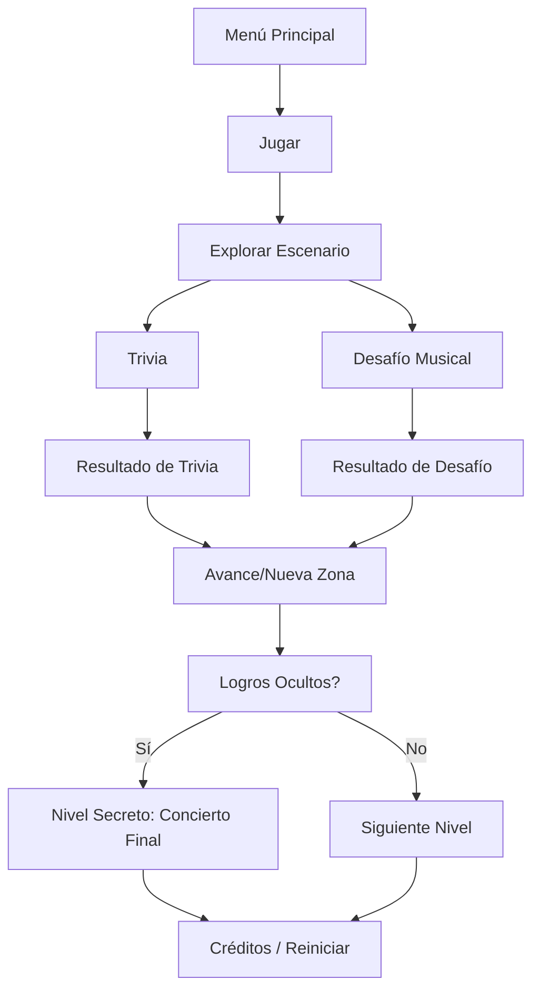

# 🎮 Rose Adventure Game

**Género:** Aventura 3D, exploración, trivia y ritmo  
*```text
flowchart TD
    A[Menú Principal] --> B[Jugar]
    B --> C[Explorar Escenario]
    C --> D[Trivia]
    C --> E[Desafío Musical]
    D --> F[Resultado de Trivia]
    E --> G[Resultado de Desafío]
    F --> H[Avance/Nueva Zona]
    G --> H
    H --> I[Logros Ocultos?]
    I -->|Sí| J[Nivel Secreto: Concierto Final]
    I -->|No| K[Siguiente Nivel]
    J --> L[Créditos / Reiniciar]
    K --> L

```eb (PC-y-móvil)

**Motor:** Babylon.js + Howler.js + Tone.js  
**Lenguaje principal:** JavaScript  
**Duración estimada:** 10–20 minutos por partida  
**Desarrollador:** Esteban Zelaya / SIORM | BP Project  

---

## 🧭 1. Concepto General

**BP-Game: Rose Adventure** es una experiencia de aventura interactiva ambientada en el universo del K-Pop, donde el jugador sigue los pasos de **Rosé** (BLACKPINK) explorando lugares inspirados en su vida, su arte y su cultura musical.

El jugador recorre escenarios temáticos, responde trivias, completa desafíos musicales y desbloquea recuerdos que reflejan distintas etapas o facetas de Rosé.  
La narrativa busca transmitir un mensaje de **crecimiento, pasión y autenticidad** — valores que definen tanto su trayectoria como el espíritu del K-Pop.

---

## 🌸 2. Narrativa y Ambientación

### Contexto

El juego inicia con el jugador “siguiendo la melodía de Rosé”, un viaje simbólico que atraviesa lugares que marcaron su historia:  
desde sus raíces en Nueva Zelanda y Australia, hasta los escenarios globales del K-Pop.

### Tono narrativo

Inspirador, melancólico y artístico.  
Cada escenario representa un **capítulo emocional** de su recorrido — crecimiento, dedicación, amor, fama, introspección.

### Estructura narrativa

1. **Inicio – “La Voz Interior”**  
   - Escenario: habitación de práctica / estudio.  
   - Introducción a controles y dinámica de exploración.  
   - Primera trivia: “¿Dónde nació Rosé?”
2. **Capítulo I – “El Salto”**  
   - Escenario: audición / escenario de debut.  
   - Primer desafío musical.  
   - Concepto: dejar atrás lo conocido.
3. **Capítulo II – “Blackpink in Bloom”**  
   - Escenario: entorno inspirado en los MVs de BP (colores intensos, arte pop).  
   - Trivia avanzada + secuencia rítmica.
4. **Capítulo III – “Soñar Despierta”**  
   - Escenario: escena onírica, estilo acuarela o neón.  
   - Desafíos de ritmo + coleccionables ocultos.
5. **Final – “El Concierto Eterno”**  
   - Desbloqueado solo si se completan todos los desafíos y logros ocultos.  
   - Mini concierto interactivo (animación, luces, cierre poético).

---

## 🕹️ 3. Mecánicas Principales

### 3.1 Exploración 3D

- Movimiento en primera o tercera persona (WASD + mouse o touch joystick).  
- Escenarios abiertos con puntos de interés interactivos.  
- Algunos objetos esconden **coleccionables** o **logros ocultos**.

### 3.2 Trivias

- Formato: pregunta + 4 opciones.  
- Activación: clic en objeto o ícono dentro del escenario.  
- Feedback inmediato (acierto/error).  
- Puntuación:
  - Correcta: +10 puntos  
  - Incorrecta: +0 (reintento posible en algunos casos)

### 3.3 Desafíos Musicales

Dos tipos básicos:
1. **Secuencia de Notas** – repetir una melodía escuchada.  
2. **Sincronización** – presionar teclas al ritmo de la música.  

- Dificultad progresiva según escenario.  
- Puntuación: +20 puntos por completado.  
- Integración de Howler.js (para audio) y Tone.js (para secuencias).

### 3.4 Sistema de Progresión

- **Puntos** → suben de forma *logarítmica*, generando “flow” y evitando frustración.  
- **Niveles** → se desbloquean al completar todos los desafíos del anterior.  
- **Logros ocultos** → completando todos, se accede al nivel secreto “El Concierto Eterno”.  

### 3.5 Pérdida o Error

- No hay “muerte” o “fail state”.  
- Los errores reducen puntos pero no bloquean el avance (enfocado en accesibilidad y exploración).

---

## 💠 4. Flujo de Juego



---

## 🧩 5. Diseño Visual y UX

- **Estilo gráfico:** realismo moderado con iluminación suave, tonos rosados, lilas y dorados.  
- **Paleta de color:**  
  - Fondo: #0B0B10  
  - Acentos: #F4B8E4 (rosa pastel), #FFD6E3, #FFFFFF  
- **Tipografía:** Quicksand o Poppins (ligera, moderna).  
- **UI minimalista:**  
  - Barra superior → puntos y nivel.  
  - Pop-ups → trivias o desafíos.  
  - Transiciones suaves con fade-in/out.

---

## 🔊 6. Audio y Sonido

- **Música de fondo:** temas instrumentales inspirados en el K-Pop (sin copyright).  
- **Efectos:** clics, aciertos, errores, desbloqueos.  
- **Ritmo:** BPM ajustado con Tone.js para los minijuegos.  
- **Ambientación:** cada escenario tiene una atmósfera (eco, crowd, estudio, etc.).  
- **Nota:** Usar samples libres o placeholder para evitar problemas de copyright con pistas de Blackpink.

---

## 🌐 7. Internacionalización (i18n)

- Soporte para inglés y español.  
- Archivos de traducción en `src/i18n.js`.  
- Textos dinámicos: trivias, mensajes de UI, pistas narrativas.  
- Selector de idioma en menú principal.

---

- **Gestor de Estado (GameState):** controla nivel actual, puntaje, logros, idioma.  
- **Guardado local:** almacenamiento en `localStorage`.  
- **Desbloqueo dinámico:** al llegar a un puntaje acumulado o cumplir condición, se habilita nueva escena.  
- **Copilot integration:** el código base será asistido con GitHub Copilot (JS context).

---

## 🧱 8. Estructura Técnica del Proyecto

```text
/bp-game-rose-adventure
│
├── /src
│   ├── main.js              # Entry point
│   ├── /scenes              # Archivos Babylon.js por nivel
│   ├── /ui                  # Menús, HUD, popups
│   ├── /assets
│   │   ├── /models          # Archivos .gltf / .glb
│   │   ├── /audio           # Música y efectos
│   │   └── /images          # Texturas, fondos
│   ├── /logic               # Sistema de trivias, progresión y logros
│   └── /utils               # Helpers, constantes, configuración
│
├── index.html
├── styles.css
├── package.json
└── Dockerfile
```

---

## 🏆 9. Logros y Recompensas

| Tipo | Nombre | Descripción | Recompensa |
|------|---------|-------------|-------------|
| Normal | Melodía Inicial | Completar la primera trivia | +10 pts |
| Normal | En Ritmo | Completar un desafío musical | +20 pts |
| Oculto | Luz y Sombra | Descubrir objeto oculto en Escenario III | +50 pts |
| Oculto | Alma de Rosé | Completar todos los desafíos con más del 90% de aciertos | Nivel secreto |
| Extra | Perfect Flow | Terminar el juego sin fallar trivias | Insignia especial |

---

## 🧰 10. Herramientas y Librerías

- **Motor 3D:** Babylon.js  
- **Audio:** Howler.js + Tone.js  
- **Control de versiones:** GitHub  
- **Asistente de desarrollo:** GitHub Copilot (GPT-Codex)  
- **IDE sugerido:** VS Code  
- **Contenedor:** Docker (para despliegue web)  
- **Hosting sugerido:** Azure Static Web Apps  

---

## 🚀 11. Roadmap de Desarrollo

| Fase | Objetivo | Estado |
|------|-----------|--------|
| F1 | Configurar entorno Babylon + Howler | ✅ |
| F2 | Implementar exploración 3D base | ☐ |
| F3 | Añadir trivias y lógica de puntuación | ☐ |
| F4 | Integrar minijuego musical (Tone.js) | ☐ |
| F5 | Crear sistema de progresión y logros | ☐ |
| F6 | Pulir UI + audio + efectos | ☐ |
| F7 | Desplegar versión beta | ☐ |
| F8 | Añadir nivel secreto y optimización móvil | ☐ |

---

## 💬 12. Créditos (provisionales)

- **Game Design & Dirección:** Esteban Zelaya  
- **Desarrollo y Arte:** SIORM Software  
- **Inspiración:** Rosé (BLACKPINK), cultura K-Pop  
- **Música y ambientación:** Instrumentales libres / producción original  

---

<!--  
Notas para Copilot:
- Generar escenas con Babylon.js.
- Integrar eventos de clic para abrir trivias.
- Implementar gestor de estados con localStorage.
- Reproducir secuencias rítmicas con Tone.js.
- Controlar UI de trivias y minijuegos con JS puro.
- Mantener el código modular y comentado.
-->
